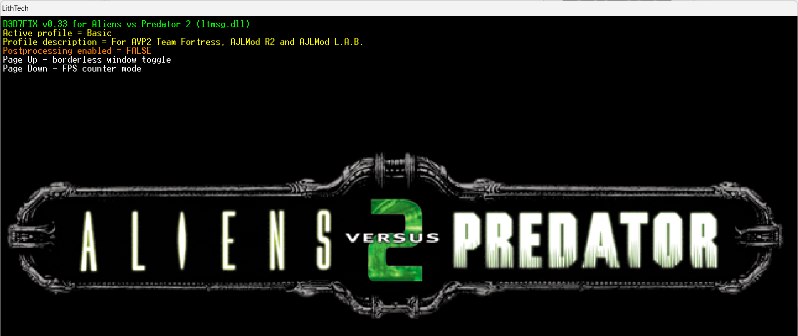

# D3D7FIX for AVP2

DDraw wrapper and collection of fixes for Aliens vs Predator 2.

### Installation

Replace **ltmsg.dll** file in the game folder. Don't forget to backup the original file.

### Usage

Launch the game with extra **D3D7FixProfile** console variable in the command line. Profiles are defined as INI sections in **ltmsg.ini**

```
lithtech.exe -rez AVP2.REZ -rez SOUNDS.REZ -rez AVP2L.REZ -rez AVP2DLL.REZ -rez MARINE.REZ -rez ALIEN.REZ -rez PREDATOR.REZ -rez MULTI.REZ -rez avp2p.rez -rez avp2p1.rez -rez avp2p5.rez +D3D7FixProfile AVP2
```

See [ltmsg.ini](ltmsg.ini) and [ltmsg_ext.ini](ltmsg_ext.ini) for fixes list and more info.



### Additional info

Postprocessing code by jermi (ddfix 1.5 for Thief 2)
